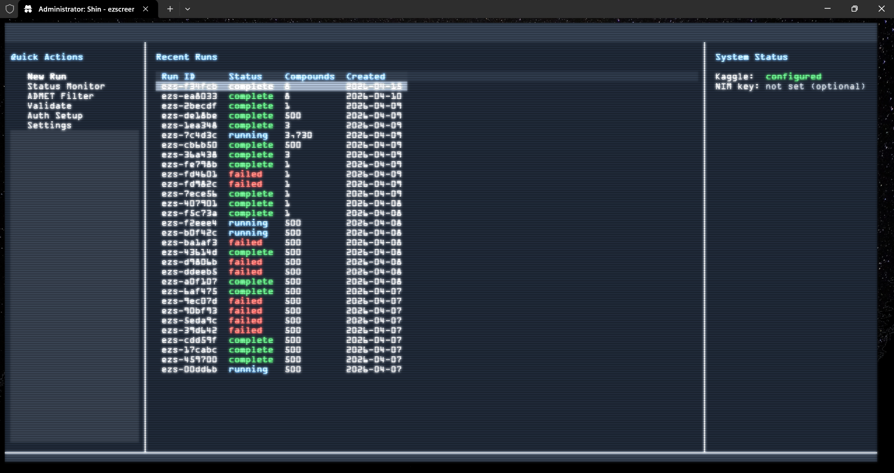
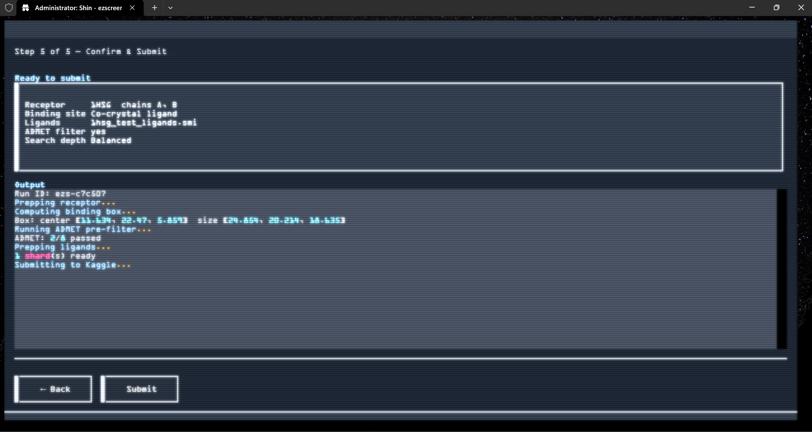
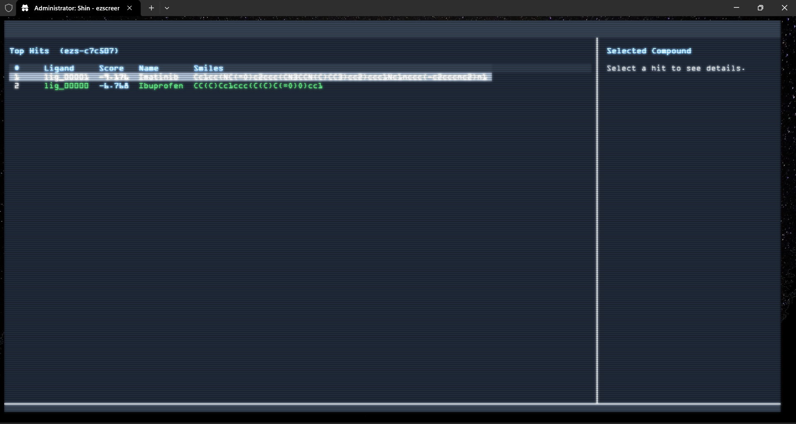

# ezscreen

**GPU-accelerated virtual screening powered by Kaggle GPUs.**

`ezscreen` is a CLI tool that runs molecular docking campaigns on Kaggle's free GPUs. It handles receptor preparation, ligand prep, ADMET filtering, Kaggle kernel submission, result download, and hit visualisation — all from an interactive full-screen TUI or a classic CLI.

## Prerequisites

- Python 3.11+
- A [Kaggle account](https://www.kaggle.com/) with GPU quota and an API token (`kaggle.json`)
- *(Optional)* NVIDIA NIM API key for Stage 2 validation with DiffDock-L

## Installation

```bash
pip install ezscreen
```

### Optional: scrubber for enhanced ligand prep

[forlilab/scrubber](https://github.com/forlilab/scrubber) provides tautomer enumeration and pH-driven protonation. Not on PyPI — install separately:

```bash
pip install git+https://github.com/forlilab/scrubber.git
```

Without it, `ezscreen` falls back to RDKit-only preparation (still fully functional).

## Setup

```bash
ezscreen auth
```

Prompts for your Kaggle `kaggle.json` path and optionally an NVIDIA NIM API key.

## Quickstart — TUI

Launch the full-screen interface:

```bash
ezscreen
```

This opens the home dashboard. From there:

- Press `r` to open the Run Wizard (5-step guided docking pipeline)
- Press `s` to open the Status Monitor (live run tracking)
- Press `?` for the full keybindings reference

### Run Wizard walkthrough

1. **Receptor** — enter a PDB ID (downloaded automatically from RCSB) or a local `.pdb` path. Select chains.
2. **Binding site** — choose from co-crystal ligand, residue list, P2Rank prediction, or blind whole-protein.
3. **Ligand library** — path to a `.smi`, `.smiles`, or `.sdf` file.
4. **Options** — toggle ADMET pre-filter and set search depth (Fast / Balanced / Thorough).
5. **Summary + submit** — review all parameters including box coordinates, then submit to Kaggle.

Results appear in the TUI Results screen when the Kaggle kernel completes.

## Quickstart — CLI

```bash
ezscreen auth          # set up credentials once
ezscreen run           # guided CLI wizard
ezscreen status        # track running jobs
ezscreen view <run_id> # show results table and open 3D viewer
```

See `examples/1hsg_quickstart.md` for a full end-to-end walkthrough against HIV-1 protease.

## Commands

| Command | Description |
|---|---|
| `ezscreen` | Launch full-screen TUI (default when no subcommand given) |
| `ezscreen tui` | Alias for the above |
| `ezscreen auth` | Configure Kaggle and NIM credentials |
| `ezscreen status` | List all runs with status (auto-refreshes) |
| `ezscreen view <run_id>` | Show results table and open 3D viewer |
| `ezscreen admet <file>` | Standalone ADMET filtering on any SDF or SMILES file |
| `ezscreen validate <receptor> <hits>` | Stage 2 re-docking via NVIDIA NIM DiffDock-L |
| `ezscreen clean <run_id>` | Delete Kaggle dataset and kernel artifacts |

## Features

- **Full-screen TUI** — Textual-based interface with dashboard, run wizard, live status monitor, and results viewer
- **UniDock GPU docking** — builds UniDock from source on Kaggle to match the installed CUDA toolkit
- **Tiered binding site detection** — co-crystal, residue Cα box, P2Rank top-3, or blind fallback
- **ADMET filtering** — Lipinski, Veber, PAINS, Brenk toxicophores applied locally before submitting to reduce wasted GPU time
- **Compound identity** — results include the original name and SMILES alongside docking scores
- **Artifact filtering** — unphysical scores (below −15 kcal/mol) removed automatically
- **Resilient download** — exponential backoff retry; local score recovery from PDBQTs if download fails
- **3D viewer** — self-contained py3Dmol HTML viewer for top poses
- **DiffDock-L validation** — NVIDIA NIM integration for high-accuracy re-docking of top hits
- **Checkpoint resume** — SQLite-backed run state; interrupted runs can be resumed mid-shard
- **Desktop notifications** — optional toast on run completion via plyer

## Screenshots







## License

Apache-2.0
